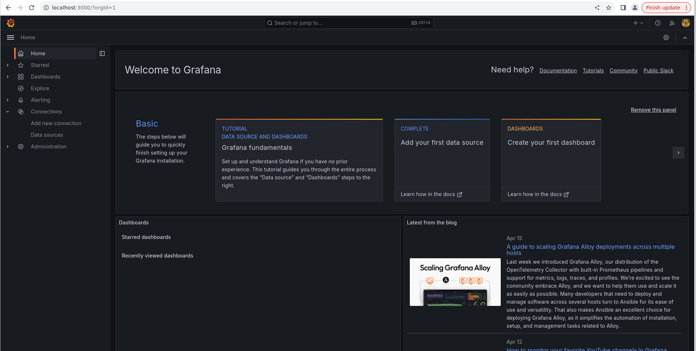

# Using Loki

1. Post Login the screen will be like this.

2. If we go to data source we can see Loki is already present as a data source in Grafana.

3. We can choose here any object to get logs.

4. Let's test with an applicatiom
```sh
$ kubectl run nginx-pod --image=nginx

$ kubectl expose pod nginx-pod --port 8080 --target-port 80

$ kubectl port-forward svc/nginx-pod 8080:8080
```
Now I'm intentionally hitting http://localhost:8080/hello-world which will give me 404

Now I'm searching Logs in Nginx App with 404 status code as text

End Result

